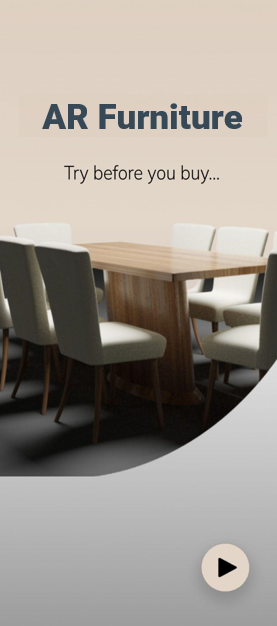
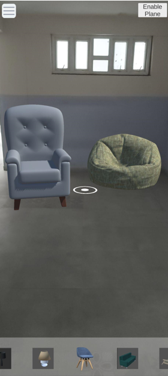
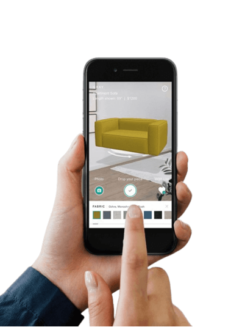
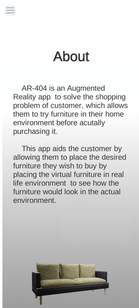

<div align="center">

# AR-FURNITURE


</div>

## Project Overview
AR Furniture is an Augmented Reality app  to solve the shopping problem of customer, which allows them to try furniture in their home environment before actually purchasing it

## Screenshots
<div align="center">






</div>

## Features
List the main features of the application. For example:
- **AR Object Placement**: Place 3D objects in the real world using AR.
- **Interactive Elements**: Tap on objects to interact with them.
- **Customizable Scenes**: Users can change scenes or environments.

## Setup Instructions
### Prerequisites
- Unity version [specific version]
- [Any specific SDKs or plugins], e.g., AR Foundation, ARCore/ARKit

### Installation
1. Clone the repository:
   ```bash
   git clone https://github.com/shrinivask007/AR_Furniture_App.git

2. Open the project in Unity:

  - Open Unity Hub.
  - Click on "Open" and navigate to the cloned repository folder.

3. Install required packages:

  - Go to Window -> Package Manager.
  - Ensure AR Foundation and other necessary packages are installed.
  - Set up platform-specific configurations:
